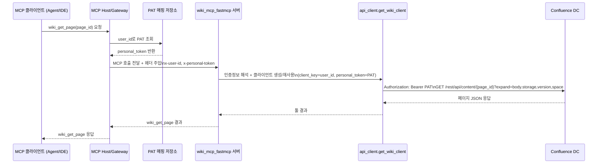

# wiki_get_page 워크플로우 (MCP Host + 사용자 PAT 매핑)

## 가정

- MCP Host가 `user_id -> personal_token` 매핑을 보유한다.
- MCP Host가 MCP 요청에 `x-user-id`, `x-personal-token` 헤더를 주입한다.
- PAT 매핑이 없으면 Host가 서버 전달 전에 `401/403`으로 차단한다.

## MCP 서버 파일별 역할 (@wiki_mcp_fastmcp/src/wiki_mcp_fastmcp)

- `__init__.py`: CLI 엔트리포인트(`main`)를 제공하고 서버 실행 옵션(host/port/path/verbose)을 파싱한 뒤 FastMCP 서버를 실행.
- `__main__.py`: `python -m wiki_mcp_fastmcp` 실행 시 `main()`으로 위임.
- `server.py`: MCP 도구 등록(`wiki_get_page` 등), 요청 헤더(`x-user-id`, `x-personal-token`) 기반 인증 정보 해석, 도구 실행 오케스트레이션.
- `api_client.py`: Confluence DC REST 호출 클라이언트. PAT Bearer 헤더 세팅, 페이지/검색/스페이스 API 호출, 클라이언트 캐시(`get_wiki_client`) 처리.
- `models.py`: Confluence API 응답을 `WikiPage`, `WikiSpace`로 변환하는 데이터 모델.

## 단계별 동작 파일 매핑 (wiki_get_page 기준)

1. MCP 클라이언트가 `wiki_get_page(page_id)` 호출: MCP Host(외부 컴포넌트) -> 서버 엔드포인트 진입은 `server.py`의 `wiki_get_page` 등록 함수.
2. `user_id`/PAT 확인: `server.py`의 `_resolve_client_credentials`, `_get_request_header`.
3. 도구 실행 래핑(에러 처리 포함): `server.py`의 `_run_tool`.
4. 동기 API 호출 준비: `server.py`의 `_wiki_get_page`에서 `get_wiki_client(...)` 호출.
5. 클라이언트 생성/재사용: `api_client.py`의 `get_wiki_client`.
6. PAT Bearer 헤더 세팅: `api_client.py`의 `WikiClient.__init__`.
7. Confluence DC 호출(`GET /rest/api/content/{page_id}`): `api_client.py`의 `WikiClient.get_page` + `_request`.
8. 응답 파싱/정규화: `models.py`의 `WikiPage.from_api_response`.
9. 툴 응답 JSON 반환: `server.py`의 `_wiki_get_page`에서 `page.to_dict()`/`json.dumps`.
